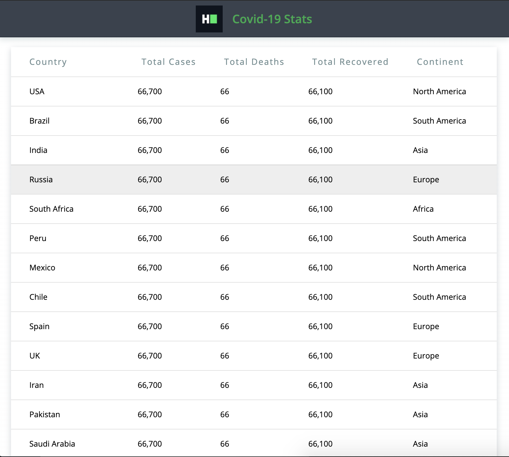

## Environment:
- Java version: 1.8
- Maven version: 3.*
- Selenium HtmlUnitDriver: 2.52.0

## Read-Only Files:
- src/test/*
- website/*
- src/main/java/com/hackerrank/selenium/server/*

## Requirements:
In this challenge, you are going to use selenium web driver, the HtmlUnitDriver, which uses HtmlUnit headless browser. So you neither need to setup the browsers like Firefox, Chrome nor a web driver executables like FirefoxDriver, ChromeDriver.
The give page has a table having 5 columns: `country,total cases,total deaths,total recovered,continent`.
 
There is a class `DataExtractor` which has 2 methods:
 
`findTotalCasesByContinent`:
 - it needs to return the sum of total cases by continent.
 - return type of this method is Map where key is continent and value is the sum of total cases of all the countries withing the continent.
 - for example: [{"Asia",57890},{"Europe",34560},{...},...]
 
`findTotalCountryByContinent`:
 - it needs to return the count of countries by continent.
 - return type of this method is Map where key is continent and value is the count of all the countries withing the continent.
 - for example: [{"Asia",4},{"Europe",20},{...},...]
 
These methods have 2 parameters, one web driver and another website URL.

There are tests for testing correctness of each methods. So you can make use of these tests while debugging/checking your implementation.
The test's setup method bootstraps an embedded jetty server and deploys small web app which displays randomly generated and simplified COVID-19 like data at the url `http://localhost:8080/home.html`.
You can view the structure of HTML page at `website/home.html` but data displayed are random and will change on every refresh.

The provided page will look like: 



Your task is to complete the implementation of those 2 methods so that the unit tests pass while running the tests.

## Commands
- run: 
```bash
mvn clean package; java -jar target/selenium-java-data-extraction-1.0.jar
```
- install: 
```bash
mvn clean install
```
- test: 
```bash
mvn clean test
```